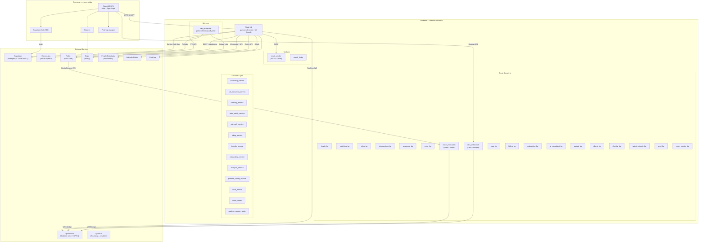
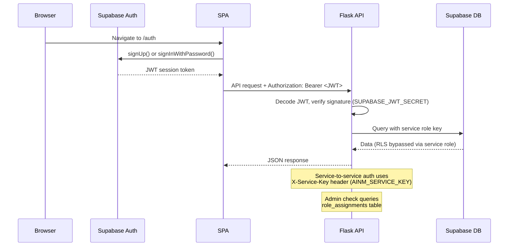

# ExecFlex Platform — Architecture As-Is

## Overview

ExecFlex (also branded as Ainm Search / ainm.ai) is an AI-powered executive recruitment and board placement platform. It connects hiring companies with senior executives, fractional leaders, and Non-Executive Directors (NEDs) through automated matching, AI-driven voice screening, and managed introductions.

The platform is split across two repositories:
- **execflex-backend** — Python/Flask API server deployed on Render.com
- **execo-bridge** — React/TypeScript SPA (frontend) deployed separately

Both share a Supabase-hosted PostgreSQL database with Row Level Security.

---

## System Architecture Diagram

---

## Component Inventory

### Backend (execflex-backend)

| Component | File(s) | Purpose | Status |
|-----------|---------|---------|--------|
| **Flask Server** | `server.py` | App entry point, blueprint registration, CORS, deploy fingerprint | Active |
| **Health** | `routes/health.py` | `GET /`, `GET /health`, `POST /submit-brief` (lead capture) | Active |
| **Matching** | `routes/matching.py` | `POST /match` — find executive matches by criteria | Active |
| **Roles** | `routes/roles.py` | `POST /post-role`, sourced candidates for roles | Active |
| **Introductions** | `routes/introductions.py` | Email introductions, candidate response handling | Active |
| **Screening** | `routes/screening.py` | Enqueue screening calls, scores, bias audit (EU AI Act) | Active |
| **Voice (Twilio)** | `routes/voice.py` | TwiML generation, status webhooks, retry backoff | Active |
| **Voice WS (Aidan)** | `routes/voice_websocket.py` | Twilio Media Streams <-> OpenAI Realtime bridge (~130KB) | Active |
| **Cara Voice** | `routes/cara_voice.py` | Browser voice session management, filesystem store | Active (recent) |
| **Cara WS** | `routes/cara_websocket.py` | Browser PCM <-> OpenAI Realtime bridge | Active (recent) |
| **Billing** | `routes/billing.py` | Stripe checkout, webhooks, placements, bulk ops (~75KB) | Active |
| **Onboarding** | `routes/onboarding.py` | Admin user mgmt, LinkedIn OAuth, platform config | Active |
| **AI Consultant** | `routes/ai_consultant.py` | Chat endpoint for AI recruiter consultant | Active |
| **Upload** | `routes/upload.py` | Bulk CSV/XLSX candidate upload with header mapping | Active |
| **Clients** | `routes/clients.py` | Client profile management | Active |
| **Shortlist** | `routes/shortlist.py` | Shareable candidate shortlists | Active |
| **Talent Network** | `routes/talent_network.py` | Public talent network opt-in | Active |
| **Seed** | `routes/seed.py` | Demo data seeder (admin-only, tagged `is_demo`) | Active |
| **Voice Monitor** | `routes/voice_monitor.py` | Synthetic probe every 5 min, email alerts | Active (recent) |
| **Call Dispatcher** | `workers/call_dispatcher.py` | Background worker polling outbound_call_jobs | Active |

### Frontend (execo-bridge)

| Component | Purpose | Status |
|-----------|---------|--------|
| **React 18 SPA** | Single-page application with React Router | Active |
| **shadcn/ui + Radix** | Component library (23 Radix primitives) | Active |
| **TailwindCSS** | Styling framework | Active |
| **TanStack Query** | Server state management / caching | Active |
| **Supabase Auth** | Client-side authentication | Active |
| **Stripe.js** | Payment integration (checkout, portal) | Active |
| **PostHog** | Product analytics | Active |
| **React Hook Form + Zod** | Form management with schema validation | Active |

### Database (Supabase PostgreSQL)

63 migration files spanning 2025-01-15 to present. Key tables:

| Table | Purpose | Personal Data? |
|-------|---------|----------------|
| `people_profiles` | Executive/candidate profiles | YES — name, location, LinkedIn |
| `organizations` | Hiring companies | Partial — company contacts |
| `opportunities` | Job/role postings | No |
| `threads` | Conversation threads | Metadata only |
| `interactions` | Call/email records, transcripts | YES — transcript text |
| `interaction_turns` | Individual conversation turns | YES — speaker text |
| `outbound_call_jobs` | Voice call queue | YES — phone numbers |
| `channel_identities` | Contact details per channel | YES — email, phone |
| `match_suggestions` | AI match results | No |
| `placements` | Completed placements | YES — salary data |
| `role_assignments` | User roles (admin/talent/hirer) | No |
| `user_preferences` | User mode settings | No |
| `linkedin_connections` | OAuth credentials | YES — encrypted tokens |
| `platform_config` | Admin-managed settings | No |
| `inbound_leads` | Landing page submissions | YES — name, email |
| `screening_bias_audit` | EU AI Act compliance trail | Metadata |
| `retainer_payments` | Retainer payment tracking | No |

---

## Authentication Flow

---

## Voice System Architecture

Two independent voice paths exist:

### Aidan (Twilio / Outbound Calls)
- Twilio initiates outbound call to candidate/employer
- Twilio Media Streams connects to `WSS /voice/ws`
- Backend bridges to OpenAI Realtime API (G.711 mu-law audio)
- ElevenLabs TTS used for voice output
- Post-call: LLM extraction of candidate profile, employer brief, scores
- Retry backoff on no-answer: 10m → 1h → 6h → 24h → 1w

### Cara (Browser / Inbound)
- Browser POSTs to `/voice-session/cara` with system prompt
- Session stored on filesystem (`/tmp/cara_sessions/`)
- Browser connects via `WSS /voice/cara/ws/<session_id>`
- Backend bridges to OpenAI Realtime API (PCM 24kHz audio)
- Shimmer voice, server VAD with higher thresholds

---

## Deployment Model

- **Backend**: Render.com, single web service
  - `gunicorn server:app --workers 1 --threads 16 --timeout 120`
  - Single worker required for WebSocket + in-process state
  - Background threads: voice monitor (5 min probe), session cleanup (2 min sweep)
- **Frontend**: Separately deployed (likely Netlify/Vercel — not confirmed from code)
- **Database**: Supabase managed PostgreSQL (project ID: `krzacydualjpsapffpfm`)
- **No separate worker process** — call dispatcher runs as HTTP endpoint (`POST /onboarding/process-jobs`)

---

## Third-Party Service Dependencies

| Service | Purpose | Required? | Credential Env Vars |
|---------|---------|-----------|---------------------|
| **Supabase** | Database + Auth | YES | `SUPABASE_URL`, `SUPABASE_SERVICE_KEY`, `SUPABASE_JWT_SECRET` |
| **OpenAI** | Realtime voice + GPT analysis | For voice | `OPENAI_API_KEY`, `OPENAI_REALTIME_MODEL` |
| **Twilio** | Outbound voice calls | For Aidan | `TWILIO_ACCOUNT_SID`, `TWILIO_AUTH_TOKEN`, `TWILIO_PHONE_NUMBER` |
| **ElevenLabs** | Text-to-speech | For voice output | `ELEVEN_API_KEY`, `ELEVEN_VOICE_ID` |
| **Stripe** | Billing, subscriptions | For billing | `STRIPE_SECRET_KEY`, `STRIPE_WEBHOOK_SECRET`, `STRIPE_GROWTH_PRICE_ID` |
| **LinkedIn** | OAuth profile import | Optional | `LINKEDIN_CLIENT_ID`, `LINKEDIN_CLIENT_SECRET`, `LINKEDIN_CALLBACK_URL`, `LINKEDIN_ENCRYPTION_KEY` |
| **People Data Labs** | Candidate enrichment | Optional | `PDL_API_KEY` (100 free/month) |
| **Apollo.io** | Candidate sourcing | Disabled | `APOLLO_API_KEY` (requires paid plan) |
| **PostHog** | Product analytics | Optional | `POSTHOG_API_KEY`, `POSTHOG_HOST` |
| **Gmail SMTP** | Outbound emails | For emails | `EMAIL_USER`, `EMAIL_PASSWORD` |
| **Google Maps** | Location autocomplete | Optional | `VITE_GOOGLE_MAPS_API_KEY` |

---

## Background / Scheduled Tasks

| Task | Trigger | Description |
|------|---------|-------------|
| Call dispatcher | HTTP endpoint (`POST /onboarding/process-jobs`) | Polls `outbound_call_jobs` for queued calls |
| Voice monitor | Background thread (300s interval) | Synthetic Cara voice probe, email alerts on failure |
| Session cleanup | Background thread (120s interval) | Removes expired `/tmp/cara_sessions/` files |
| Post-call extraction | Fire-and-forget from webhook | GPT analysis of call transcripts (screening scores, candidate profile, employer brief) |
| Auto-match + outreach | Fire-and-forget from `/post-role` | Matches approved candidates against new role, sends outreach emails |
| PDL sourcing | Fire-and-forget from `/post-role` | Searches People Data Labs for additional candidates |

---

## LLM / AI Call Sites

| Location | Provider | Model | Purpose |
|----------|----------|-------|---------|
| `routes/voice_websocket.py` | OpenAI | gpt-realtime (Realtime API) | Live voice conversations (Aidan) |
| `routes/cara_websocket.py` | OpenAI | gpt-realtime (Realtime API) | Live voice conversations (Cara) |
| `services/call_extraction_service.py` | OpenAI | GPT-4 | Post-call transcript analysis |
| `services/screening_service.py` | OpenAI | GPT-4 | Screening call scoring |
| `services/outreach_service.py` | OpenAI | GPT-4 | LLM-generated outreach emails |
| `routes/ai_consultant.py` | OpenAI | GPT-4 | AI recruiter consultant chat |
| `services/auto_match_service.py` | OpenAI | GPT-4 | Match reasoning |
| ElevenLabs integration | ElevenLabs | Configured voice | TTS for voice calls |
